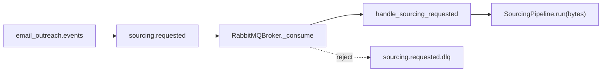

# Sourcing service: subscribe to `sourcing.requested`

## Goal

Wire the sourcing service consumer so that it:

- Connects to RabbitMQ from [src/local_infrastructure/rabbit_mq/docker-compose.yml](src/local_infrastructure/rabbit_mq/docker-compose.yml).
- Subscribes to the durable queue `sourcing.requested` ([definitions.json](src/local_infrastructure/rabbit_mq/definitions.json) line 49 — DLX `email_outreach.dlx`, DLQ routing key `sourcing.requested.dlq`).
- Dispatches messages into [SourcingPipeline](src/sourcing/pipeline.py) without changing `run(self, body: bytes)` (thin adapter encodes `dict` → bytes).

Uses the same **async** broker pattern as [src/planning/planning/main.py](src/planning/planning/main.py) (`local_infrastructure.factory` + `create_broker()`).

## Compliance with [Ai_rules.md](Ai_rules.md)

The implementation must satisfy these mandatory standards:

### Logging and observability (§1)

- **No** `print()` or unstructured-only console output for application events — use **structlog** (same stack as planning’s [logging_setup.py](src/planning/planning/logging_setup.py)) so every line is JSON with **timestamp**, **level**, and **message**.
- Bind a **correlation ID** per consumed message when available (e.g. `request_id` from payload, else a short generated id) and include it on pipeline-related logs for multi-service tracing.
- **Service/module name**: use a stable logger name (e.g. `sourcing`, `sourcing.handlers`) in every log.
- **Lifecycle**: `info` on successful service start (after Mongo + subscription), `info` on graceful shutdown start, **`error` if shutdown or disconnect fails** (with exception attached).
- **Pipelines**: keep existing [pipeline.py](src/sourcing/pipeline.py) stage logging; when touching the entry path, ensure message receipt logs include correlation id where applicable. Prefer `debug` only for noisy internals.

### Error handling (§2)

- Use `raise NonRetryableError(...) from exc` when wrapping `PlanNotFoundError` — **preserve chains**.
- **Never** catch and ignore: broker `disconnect` / Mongo close failures must be logged at `error` with the exception; re-raise only if the process must fail loudly (document choice in code).
- Async handler: no bare `except`; consumer loop already logs in `RabbitMQBroker._consume` — handler should raise domain errors explicitly (`NonRetryableError` for non-retryable cases only).

### Code style and structure (§3)

- **Type hints** on all new public functions; **PEP 8**; imports: stdlib → third-party → internal.
- **Single responsibility**; **~40 line max** per function — split `amain()` into small helpers (e.g. `_run_consumer`, `_install_signal_handlers`) if it grows past that.
- Match patterns in files being edited (planning’s lifespan style where relevant).

### Security and secrets (§4)

- RabbitMQ URL and Mongo URL **only** from environment / `.env` (never hardcode credentials in source or tests).
- **Commit only** `.env.example` with placeholders; never commit `.env`.

### Testing (§5)

- **Pytest** only (existing convention under `src/sourcing/tests/`).
- **At least one test per new module** (`handlers.py` covered).
- **Arrange → Act → Assert**; descriptive test names (e.g. `test_handle_sourcing_requested_passes_round_trip_json_bytes_to_pipeline`).
- **Unhappy path**: `PlanNotFoundError` → `NonRetryableError` with chain preserved.
- **Mock** `SourcingPipeline` in unit tests — **no real RabbitMQ or Mongo** in handler unit tests.
- Before marking work done: **run full test suite** for affected packages; aim **≥80% coverage on new code** and do not reduce overall coverage.

---

## Architecture (unchanged)

---

## Concrete implementation steps

### 1. Restore shared broker package

Restore from `git` HEAD (currently deleted in working tree):

- `src/local_infrastructure/factory/__init__.py`
- `src/local_infrastructure/factory/broker_interface.py`
- `src/local_infrastructure/factory/broker_factory.py`
- `src/local_infrastructure/factory/rabbitmq_broker.py`

Leave `src/sourcing/messaging/` removed — replaced by shared factory.

### 2. Structured logging module for sourcing

Add `src/sourcing/logging_setup.py` modeled on planning’s `configure_logging` (structlog JSON to stdout, level from env e.g. `LOG_LEVEL`, default `INFO`). **`main.py` calls this first.**

### 3. Handler module

`src/sourcing/handlers.py`:

- `async def handle_sourcing_requested(message: dict[str, Any], pipeline: SourcingPipeline, log: BoundLogger | None = None) -> None` (or inject logger via structlog `get_logger(__name__)`).
- Bind **correlation_id** = `message.get("request_id")` or `str(uuid4())` once per message.
- `body = json.dumps(message, separators=(",", ":")).encode("utf-8")` then `await pipeline.run(body)`.
- On `PlanNotFoundError`: `raise NonRetryableError(...) from e`.

Keep handler body short; extract encoding to `_message_dict_to_body` if needed for line limits.

### 4. Rewrite `src/sourcing/main.py`

- `asyncio.run(amain())` pattern.
- `configure_logging(os.getenv("LOG_LEVEL", "INFO"))` then `structlog.get_logger("sourcing").info("sourcing service starting", ...)`.
- `await init_db()`; log `db_name` at **info**.
- `broker = create_broker()`; `partial(handle_sourcing_requested, pipeline=pipeline)`; `await broker.subscribe(QUEUE_SOURCING_REQUESTED, handler)`.
- `info` log: subscribed queue name, broker env summary (type only — **not** passwords).
- Block on `asyncio.Event` until SIGINT/SIGTERM; Windows fallback as in prior plan.
- `finally`: `try/except` around `await broker.disconnect()` — **log at error** on failure; close Mongo client; **info** shutdown complete.

### 5. Dependencies and Docker

- [src/sourcing/requirements.txt](src/sourcing/requirements.txt): `aio-pika>=9.4,<10`, `structlog>=24.4,<25`; remove `pika` if unused.
- [src/sourcing/Dockerfile](src/sourcing/Dockerfile): `COPY local_infrastructure /app/local_infrastructure` when context allows.
- Optional: add `sourcing` service to [src/local_infrastructure/docker-compose.yaml](src/local_infrastructure/docker-compose.yaml) with env from secrets-safe placeholders.

### 6. Environment

[src/sourcing/.env.example](src/sourcing/.env.example): `BROKER_TYPE`, `RABBITMQ_URL`, `RABBITMQ_EXCHANGE`, `RABBIT_PREFETCH`, `LOG_LEVEL`, existing `MONGO_*` — all example values, no real secrets.

### 7. Tests

[src/sourcing/tests/test_handlers.py](src/sourcing/tests/test_handlers.py):

- Happy path: mock pipeline records `run` args — assert bytes round-trip matches JSON of input dict.
- Unhappy path: mock raises `PlanNotFoundError` — assert `NonRetryableError` and **`__cause__` is the original** (chain preserved).

Run `pytest src/sourcing/tests` and broader suite per §5.

---

## Verification checklist

1. Broker up: `docker compose` for [rabbit_mq/docker-compose.yml](src/local_infrastructure/rabbit_mq/docker-compose.yml).
2. Start sourcing: logs show structured JSON, startup **info**, correlation on message handling.
3. Publish via [publish_sourcing_requested.py](src/local_infrastructure/scripts/publish_sourcing_requested.py) — pipeline stages appear in logs.
4. Bad `plan_id`: DLQ receives message; logs show **error**/non-retryable path without silent swallow.
5. `pytest` green; coverage on new modules **≥80%** where measurable.

---

## Deviation note

If structlog conflicts with a project decision to use only stdlib logging, defer to project standards and document in `logging_setup.py` — otherwise **structlog is required** by Ai_rules.md “structured logger” + alignment with planning.
