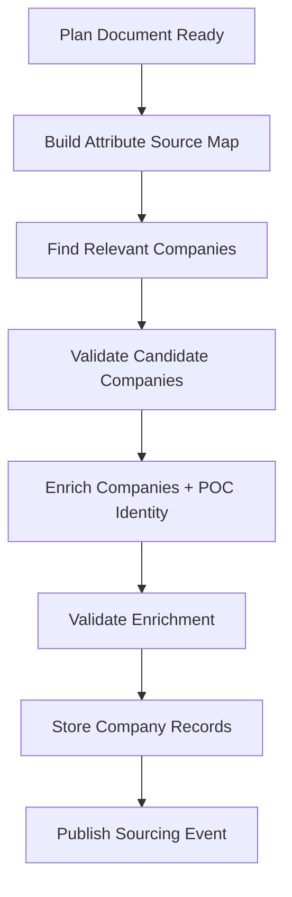

# Data Sourcing Service

Implementation-oriented design for the **Sourcing** service: validated discovery, enrichment, POC identity cues, hints, provenance — aligned with [`data_sourcing_map.md`](../data_sourcing_map.md), additive Plan filters in [`planning_service_role.md`](../planning_service_role.md), and the system overview in [`README.md`](../README.md).

## Table of contents

1. [Purpose and service boundary](#1-purpose-and-service-boundary)
2. [Relationship to Planning and Prospecting](#2-relationship-to-planning-and-prospecting)
3. [Inputs and outputs](#3-inputs-and-outputs)
4. [End-to-end pipeline](#4-end-to-end-pipeline)
5. [Attribute source map](#5-attribute-source-map)
6. [Source catalog and usage rules](#6-source-catalog-and-usage-rules)
7. [Scraping and extraction pipeline](#7-scraping-and-extraction-pipeline)
8. [Validation gates and failure modes](#8-validation-gates-and-failure-modes)
9. [Storage model](#9-storage-model)
10. [Queue contracts and idempotency](#10-queue-contracts-and-idempotency)
11. [Operational constraints](#11-operational-constraints)

---

## 1. Purpose and service boundary

**Role:** Mine public data to find **relevant companies**, enrich **company records**, and attach **POC identities** (names, titles, public profile cues) matching the Plan Document — using a **cache-first** strategy aligned with [`data_sourcing_map.md`](../data_sourcing_map.md) (directories → validation → enrichment). **Commercial work email acquisition** is **not** part of this service.

**In scope**

- Consume `sourcing.requested` and load the **Plan Document** (via `plan_id`) for attribute targets, [`planning_service_role.md`](../planning_service_role.md) **search blocks** where present, and constraints.
- Build an **attribute-to-source map** before calling external systems.
- **Company discovery:** validated candidate domains from Tier A directories and Tier B hints (validated before enrichment spend).
- **Company enrichment:** fill `company_record` fields and `extra` from approved sources (web, careers, filings, SERP scoped to known companies, etc.).
- **POC identity:** identify plausible contacts from public sources permitted by policy (sites, announcements, NIH PIs, Product Hunt makers, etc.) and persist `persons` skeletons linked to companies — **without** Apollo/Hunter email waterfall.
- Normalize output, attach **provenance**, compute **data completeness**, emit `sourcing.completed` / `sourcing.partial`.

**Out of scope (belongs to Prospecting)**

- **Work email lookup, enrichment, or verification** (Apollo.io, Hunter.io, similar).
- **ICP fit scoring**, ranking, and cutoff thresholds vs the Plan weights.

---

## 2. Relationship to Planning and Prospecting

| Service    | Responsibility |
|-----------|----------------|
| **Planning** | Produces the Plan Document: `company_signals`, `poc_signals`, `scoring_weights`, `personalization_hooks`, tone, angle, plus optional per-source **`search_blocks`**, **`global_filters`**, and **`outreach_context`** ([`planning_service_role.md`](../planning_service_role.md)). |
| **Sourcing** | Validated discovery + enrichment + **POC identity**; persists companies, hints, POC skeletons with provenance. **No** Apollo/Hunter email passes. |
| **Prospecting** | **Apollo / Hunter-style email discovery & verification**, ICP scoring, semantic search over `extra`, ranking vs thresholds — then hands ranked prospects toward messaging. |

---

## 3. Inputs and outputs

### 3.1 Primary input (queue)

Base contract (from [README.md](../README.md)):

```text
sourcing.requested → { campaign_id, plan_id, target_entities[] }
```

**Implementation extension (recommended):** the Orchestrator may include optional fields Sourcing should accept without breaking older consumers:

```json
{
  "campaign_id": "uuid",
  "plan_id": "uuid",
  "target_entities": [],
  "request_id": "uuid",
  "config": {
    "max_companies": 500,
    "discovery_mode": "yc_only | broad | seed_domains",
    "freshness_override_days": null
  },
  "seeds": {
    "domains": ["example.com"],
    "company_names": ["Acme Inc"]
  }
}
```

- `target_entities` may be empty when the campaign expects **discovery-only** from configured sources (e.g. YC directory + filters); otherwise it lists explicit companies/domains to enrich.
- `request_id` supports idempotency and deduplication of writes (see [§10](#10-queue-contracts-and-idempotency)).

### 3.2 Outputs

- **MongoDB:** Upserted `company_record` and linked `person` / POC identity documents where applicable (see [§9](#9-storage-model)).
- **Events:**
  - `sourcing.completed` — `{ campaign_id, entity_ids[] }` (entity IDs = sourced company IDs).
  - `sourcing.partial` — `{ campaign_id, entity_id, missing_fields[] }` when enrichment is incomplete but still useful.

Optional extension for observability (if all consumers tolerate extra keys):

```json
{
  "campaign_id": "uuid",
  "entity_ids": ["uuid"],
  "stats": {
    "companies_discovered": 120,
    "companies_enriched": 115,
    "rejected_candidates": 40
  }
}
```

---

## 4. End-to-end pipeline

1. **Load plan** — Fetch `plan_record` / Plan Document by `plan_id`; read `company_signals`, `poc_signals`, `personalization_hooks`, **`search_blocks` / sourcing config** ([`planning_service_role.md`](../planning_service_role.md)), and campaign flags.
2. **Cache check** — For each candidate or seed entity, apply the **cache-first** rules from [README.md](../README.md) (no data → scrape all; partial → gap fill; fresh + complete → no scrape).
3. **Build attribute source map** — Deterministic map from requested attributes → sources, templates, schemas, fallbacks ([§5](#5-attribute-source-map)); align sources with [`data_sourcing_map.md`](../data_sourcing_map.md).
4. **Company discovery** — Tier A directories (YC, Crunchbase, Product Hunt; NIH Reporter for HC) plus Tier B hints (HN, public LinkedIn company pages) validated before enrichment ([`data_sourcing_map.md`](../data_sourcing_map.md)).
5. **Candidate validation** — Relevance, deduplication, domain sanity, blocklists ([§8](#8-validation-gates-and-failure-modes)).
6. **Company enrichment** — Website/blog + careers pipelines (crawl4ai + LLM), targeted filings (e.g. SEC Form D), OpenCorporates, SERP anchored to `(name, domain)` only ([§6](#6-source-catalog-and-usage-rules)).
7. **POC identity mining** — Public sources only — fill names/titles/URLs per `poc_signals` without commercial email enrichment.
8. **Enrichment validation** — Schema, evidence, completeness.
9. **Store and emit** — Persist MongoDB documents + hints, publish `sourcing.completed` or `sourcing.partial`.



---

## 5. Attribute source map

Before calling external APIs or scrapers, Sourcing builds a **AttributeSourceMap**: a list of rules that bind each logical attribute to one or more sources and extraction strategies.

### 5.1 Rule object schema

| Field | Type | Description |
|-------|------|-------------|
| `attribute` | `string` | Logical name, e.g. `domain`, `industry`, `employee_count`, `funding_stage`, `tech_stack`, `description`, `linkedin_company_url`, `recent_news_summary`. |
| `source_type` | `enum` | `api`, `serp`, `scrape`, `directory`, `hint_feed`. |
| `source_name` | `string` | e.g. `yc_directory`, `product_hunt`, `company_website`, `serp`, `hn_newest`. |
| `allowed_for_discovery` | `boolean` | If `true`, this source may be used to **enumerate** candidate companies. |
| `allowed_for_enrichment` | `boolean` | If `true`, may be used to **fill attributes** for a known company. |
| `query_template` | `string \| null` | Template with placeholders: `{{company_name}}`, `{{domain}}`, `{{icp_keyword}}`. Used for SERP or directory search. |
| `extraction_schema` | `JSON Schema` | Expected LLM or parser output shape for this attribute from markdown or API JSON. |
| `confidence_weight` | `float` | 0–1; used when merging conflicting values. |
| `priority` | `int` | Lower = tried first among rules for the same attribute. |
| `fallback_sources` | `string[]` | Ordered list of `source_name` values if primary fails or low confidence. |

### 5.2 Discovery vs enrichment

| Mode | Purpose | SERP | YC directory | HN newest |
|------|---------|------|--------------|-----------|
| **Discovery** | Build a list of companies | **No** (not for broad lists) | **Yes** (if ICP = startups) | **Hints only** — queue URLs/names for validation, not authoritative |
| **Enrichment** | Fill fields for a known `name` + `domain` | **Yes** — company-specific queries only | **Yes** — profile page if company is in YC | **Optional** — e.g. “Show HN” link to product page |

**Rule:** **SERP** must include an anchor: company name and/or registered domain, so results are tied to a specific entity—not used to discover the open web unbounded.

### 5.3 Example (illustrative YAML)

```yaml
attributes:
  - attribute: domain
    source_type: directory
    source_name: yc_directory
    allowed_for_discovery: true
    allowed_for_enrichment: true
    extraction_schema:
      type: object
      properties: { domain: { type: string, format: hostname } }
    confidence_weight: 0.95
    priority: 1

  - attribute: recent_news_summary
    source_type: serp
    source_name: serp
    allowed_for_discovery: false
    allowed_for_enrichment: true
    query_template: "{{company_name}} {{domain}} funding OR product launch news"
    extraction_schema:
      type: object
      properties:
        summary: { type: string, maxLength: 500 }
        source_urls: { type: array, items: { type: string, format: uri } }
    confidence_weight: 0.6
    priority: 2
    fallback_sources: ["company_website_blog"]
```

---

## 6. Source catalog and usage rules

### 6.1 Y Combinator — [The YC Startup Directory](https://www.ycombinator.com/companies)

- **Use:** Startup-oriented **discovery** and structured fields available on directory/company pages (e.g. name, description, batch, website).
- **Integration:** Prefer HTML scrape / CSV parity with **`data_sourcing_map.md`**; treat as authoritative **Tier A discovery** whenever the startup vertical applies.

### 6.2 Hacker News — [newest](https://news.ycombinator.com/newest)

- **Use:** **Hints only** — emerging products, “Show HN”, startup announcements.
- **Do not:** Treat as a complete or stable company database.
- **Pipeline:** Extract candidate company name + URL → run through **candidate validation** → then enrich like any other lead.

### 6.3 SERP (search engine results page)

- **Use:** **Enrichment only** after a specific company is identified (name/domain).
- **Typical queries:** Funding, press, careers page, product launch, site-specific pages.
- **Do not:** Use unconstrained SERP to harvest large company lists (cost, quality, policy).

### 6.4 LinkedIn (public company pages)

- **Use:** **Discovery hints** + light company-profile enrichment when policy allows scraping public listing pages (`data_sourcing_map.md` Tier B / enrichment).
- **Typical attributes:** Employee range band, industry, description, canonical company URL — **not** logged-in recruiter APIs unless separately licensed.

### 6.5 Company website / blog / careers

- **Use:** Primary **enrichment** for description, stack hints, hiring signals, and personalization hooks.
- **Mechanism:** crawl4ai → markdown → low-cost LLM extraction ([§7](#7-scraping-and-extraction-pipeline)).

### 6.6 Alignment with README + data sourcing map

Sourcing pipelines follow **`data_sourcing_map.md`** *Phase 1 (discovery)* and *Phase 2 (enrichment)* — **directories and APIs where available**, scoped **SERP**, and **headless crawl** for owned web properties — **not** the legacy “Layer 1 = commercial contact APIs” split (those APIs are bounded to Prospecting email workflows in [README.md](../README.md)). Use `fallback_sources` in attribute rules to encode the Tier A/Tier B precedence from the map.

---

## 7. Scraping and extraction pipeline

### 7.1 Stages

1. **URL discovery** — From directory links, SERP results, sitemap, or known `/about`, `/blog`, `/careers` paths.
2. **Fetch** — Headless fetch with timeouts, redirect limits, and content-type checks.
3. **Markdown conversion** — **crawl4ai** (or equivalent) converts HTML to **markdown** for stable, token-efficient input.
4. **Structured extraction** — A **low-cost LLM** maps markdown (and/or API JSON) to the **extraction JSON Schema** defined in the attribute map.
5. **Evidence capture** — Store snippet spans, selectors, or char offsets where feasible; always store **canonical URL** and **retrieved_at**.

### 7.2 LLM extraction contract

- **Input:** `{ "url", "markdown": "...", "requested_attributes": ["industry", ...] }`
- **Output:** JSON matching the combined `extraction_schema` for those attributes.
- **Constraints:**
  - **Schema-bound:** No free-form prose except fields explicitly allowed (e.g. `recent_news_summary`).
  - **No business decisions:** The LLM does not decide ICP fit or whether to keep a company; deterministic rules and Prospecting do.
  - **Hallucination guard:** If the markdown does not support a field, return `null` and optional `unsupported_reason`.

### 7.3 Cost and quality controls

- Chunk long markdown; extract only requested attributes per chunk.
- Cache markdown and extraction results keyed by `(url, schema_version, content_hash)` to avoid repeat LLM calls.

---

## 8. Validation gates and failure modes

### 8.1 Candidate validation (post-discovery, pre-persist)

- **ICP relevance** — Keyword, industry, stage, geography vs Plan Document (rules or small classifier; deterministic threshold documented per campaign).
- **Deduplication** — Same `domain` (normalized) or strong name+location match → merge or skip.
- **Domain sanity** — Valid TLD, not a parking page, MX optional depending on plan.
- **Blocklist** — Competitors, excluded industries, sanctioned regions if configured.

### 8.2 Enrichment validation

- **Schema validation** — Output must match `extraction_schema`.
- **Evidence** — Required fields must have at least one `source_url` when sourced from web/SERP.
- **Freshness** — Compare to `freshness_timestamp` / campaign `freshness_days` ([README.md](../README.md)).
- **Conflict resolution** — When two sources disagree, use `confidence_weight` and source priority; if still ambiguous, store both under `extra` with provenance and lower confidence.

### 8.3 Failure mode codes

Use in logs, `sourcing.partial` context, and internal `company_record` status if modeled:

| Code | Meaning |
|------|---------|
| `company_rejected` | Failed candidate validation; not stored as active lead. |
| `data_incomplete` | Stored with gaps; `missing_fields` listed in partial event. |
| `source_unavailable` | HTTP error, rate limit, or API down. |
| `extraction_failed` | LLM/parse error or schema mismatch. |
| `validation_failed` | Evidence or sanity check failed. |

---

## 9. Storage model

Compatible with `company_record` in [README.md](../README.md): core fields plus semi-structured `extra`; stored as documents in **MongoDB** alongside linked POC identity records emitted by this service before Prospecting enrichment.

### 9.1 Provenance and evidence

Extend each stored attribute (core or `extra`) with optional **provenance** metadata. Two implementation options:

**Option A — Sidecar map** (recommended for query clarity): a top-level map `provenance` whose keys are **attribute names** (core fields or keys under `extra`). Each value is an `AttributeProvenance` object with this shape (implemented in `src/shared/models/company.py` as Pydantic `AttributeProvenance`):

| Field | Type | Description |
|-------|------|-------------|
| `source_name` | `string` | e.g. `linkedin_public_company`, `serp`, `yc_directory`, `company_website` |
| `source_type` | `enum` | `api` \| `serp` \| `scrape` \| `directory` \| `hint_feed` |
| `observed_value` | `any \| null` | Raw value from the source before normalization |
| `normalized_value` | `any \| null` | Value after normalization (what is stored in the field / `extra` key) |
| `confidence` | `float` | 0.0–1.0 (e.g. from the attribute source map’s `confidence_weight`) |
| `evidence_urls` | `string[]` | URLs where the value was observed |
| `snippet` | `string \| null` | Text excerpt supporting the value |
| `extracted_at` | ISO-8601 `datetime` | When this extraction was recorded |

When two sources disagree on the same attribute, the higher-confidence value wins the primary field; the other may be kept under a distinct `extra` key (e.g. `industry__alt`) with its own provenance entry.

**Example (abbreviated `company` document, Option A):**

```json
{
  "id": "uuid",
  "name": "Example Inc",
  "domain": "example.com",
  "industry": "developer tools",
  "data_completeness": 0.82,
  "freshness_timestamp": "2026-04-25T12:00:00Z",
  "scrape_mode_last": "partial",
  "campaign_ids": ["uuid"],
  "extra": {},
  "provenance": {
    "industry": {
      "source_name": "linkedin_public_company",
      "source_type": "scrape",
      "observed_value": "Computer Software",
      "normalized_value": "developer tools",
      "confidence": 0.9,
      "evidence_urls": [],
      "snippet": null,
      "extracted_at": "2026-04-25T12:00:00Z"
    },
    "recent_news_summary": {
      "source_name": "serp",
      "source_type": "serp",
      "observed_value": null,
      "normalized_value": "Launched new analytics API in Q1.",
      "confidence": 0.55,
      "evidence_urls": ["https://example.com/press/2026-launch"],
      "snippet": "…",
      "extracted_at": "2026-04-25T12:00:00Z"
    }
  }
}
```

**Option B — Values only in `extra`** with keys like `industry__source` — less normalized but simpler for early prototypes.

### 9.2 Raw artifacts

- Store **full markdown** only when needed for debugging (e.g. S3 object with TTL), or cap size in Mongo `extra.raw_markdown_preview` (first N chars).
- Always store `content_hash` to detect page changes on re-scrape.

### 9.3 Hints collection (`hints`)

A **Hint** is a **personalization signal** tied to a `company_id` and `campaign_id`, produced during **discovery** or **enrichment**. It answers *why* a company might be interested in the product (funding, hiring, launch, content, etc.) and supplies evidence (`source_url`, `raw_snippet`) for downstream **Prospecting** (optional relevance ranking) and **Messaging** (LLM email drafts). It is not a substitute for the canonical `company_record`; it complements it.

Collection: `hints`. See `src/shared/models/hint.py` (`Hint` / Beanie).

| Field | Type | Description |
|-------|------|-------------|
| `id` | `string` (uuid) | Document id (Mongo `_id` when using string ids) |
| `company_id` | `string` | Ref → `companies` / `CompanyRecord` |
| `campaign_id` | `string` | Campaign this signal was collected for |
| `category` | `enum` | `funding` \| `hiring` \| `product_launch` \| `tech_stack` \| `news` \| `partnership` \| `expansion` \| `content` \| `other` |
| `summary` | `string` | Short, human-readable explanation of the signal (usable in LLM prompts) |
| `source_name` | `string` | e.g. `serp`, `company_blog`, `hn_newest`, `yc_directory` |
| `source_type` | `enum` | Same as provenance: `api` \| `serp` \| `scrape` \| `directory` \| `hint_feed` |
| `source_url` | `string \| null` | Canonical URL where the signal was observed |
| `raw_snippet` | `string \| null` | Supporting excerpt from the page/API |
| `relevance_score` | `float \| null` | 0.0–1.0; optional, set by pipeline or Prospecting for “how relevant to this product” |
| `discovered_at` | ISO-8601 `datetime` | When the hint was recorded |
| `extra` | `object` | Arbitrary additional structured fields |

**Indexes (recommended):** `company_id`, `campaign_id`, compound `(company_id, campaign_id)`, `category`.

**Relationship:** `Hint.company_id` → `CompanyRecord.id` (many hints per company per campaign are normal).

---

## 10. Queue contracts and idempotency

### 10.1 Messages (authoritative from [README.md](../README.md))

| Event | Payload |
|-------|---------|
| `sourcing.requested` | `{ campaign_id, plan_id, target_entities[] }` |
| `sourcing.completed` | `{ campaign_id, entity_ids[] }` |
| `sourcing.partial` | `{ campaign_id, entity_id, missing_fields[] }` |

### 10.2 Idempotency and at-least-once delivery

- Queues are **durable** with **at-least-once** delivery; consumers must be **idempotent**.
- **Idempotency key:** `hash(campaign_id + plan_id + request_id + entity_id + operation)` for each upsert.
- **Dedup:** Reprocessing the same `sourcing.requested` should not create duplicate `company_record` rows for the same normalized domain; use upsert on `(domain)` or `external_ids.yc_slug` etc.
- **Partial events:** May be emitted multiple times for the same entity as more fields fill in; downstream consumers should merge by `entity_id`.

### 10.3 Retries and DLQ

- Follow platform defaults ([README.md](../README.md)): retries with DLQ; sourcing workloads may use longer visibility timeouts (see [cloud_INFRASTRUCTURE.md](../cloud_INFRASTRUCTURE.md) for AWS examples).

---

## 11. Operational constraints

- **Rate limits:** Per provider token bucket; global concurrency cap for headless browsers on scraping node pools.
- **Robots.txt / ToS:** Respect site policies; **public-page scraping only** for LinkedIn unless a separate vendor API contract exists.
- **User-Agent:** Identifiable, honest UA string; include contact in comments if required by policy.
- **SERP:** Quota and cost monitoring; block overly generic queries.
- **Secrets:** API keys in secrets manager, not in code (see [Repository_structure.md](../Repository_structure.md), `email-outreach/*` secrets).
- **Observability:** Log `source_name`, `latency_ms`, `outcome` per call; trace IDs across fetch → markdown → LLM.
- **LLM use:** Extraction and summarization only; deterministic validation gates stay here. **Scoring thresholds and outbound email-worthiness** are decided in Prospecting once commercial emails exist.

---

## Document history

- **v1** — Initial implementation-oriented Sourcing spec (attribute map, sources, pipeline, storage, queues).
- **v3** — Service boundary refresh: POC identity vs Apollo/Hunter; MongoDB wording; aligns docs with README + sourcing map rewrite.

See also: [README.md](../README.md), [`data_sourcing_map.md`](../data_sourcing_map.md), [`planning_service_role.md`](../planning_service_role.md), [Repository_structure.md](../Repository_structure.md).
